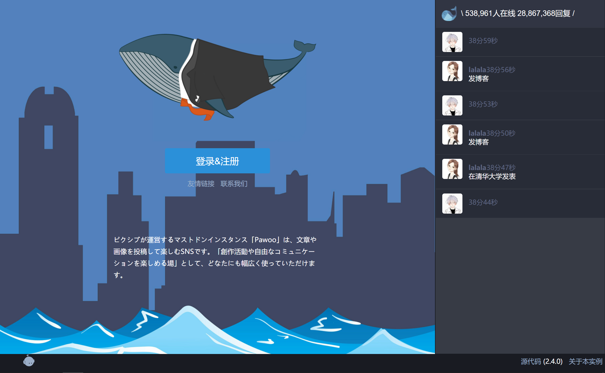
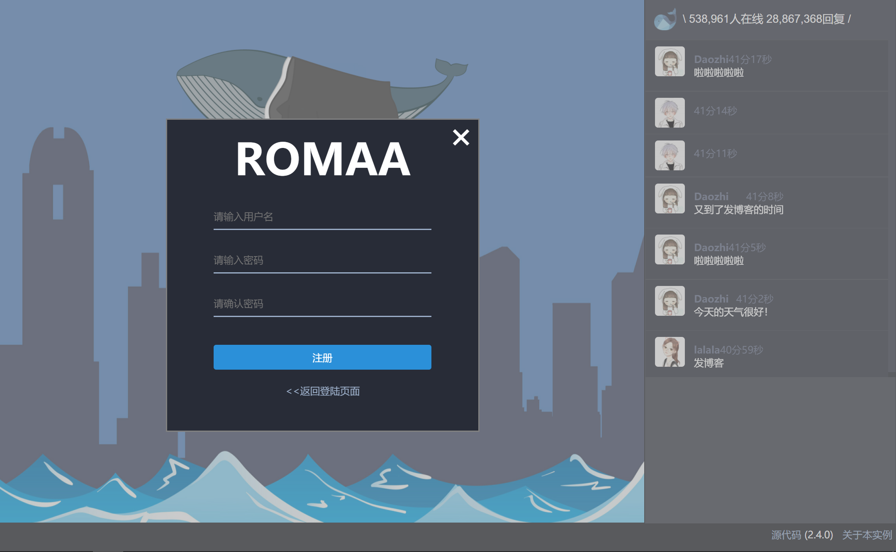
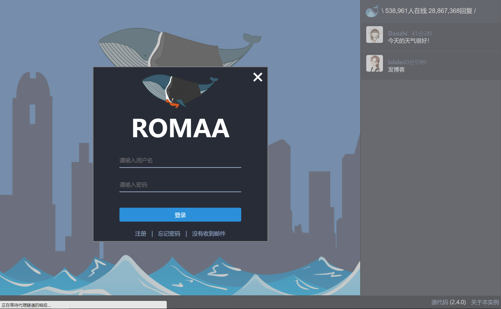
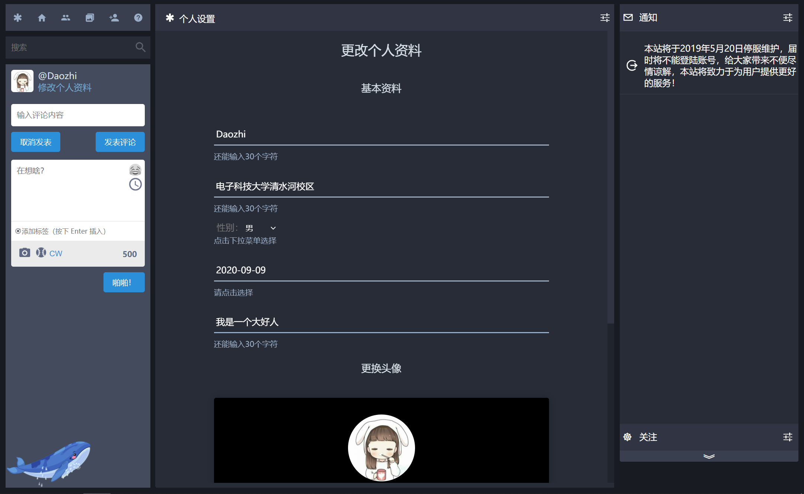
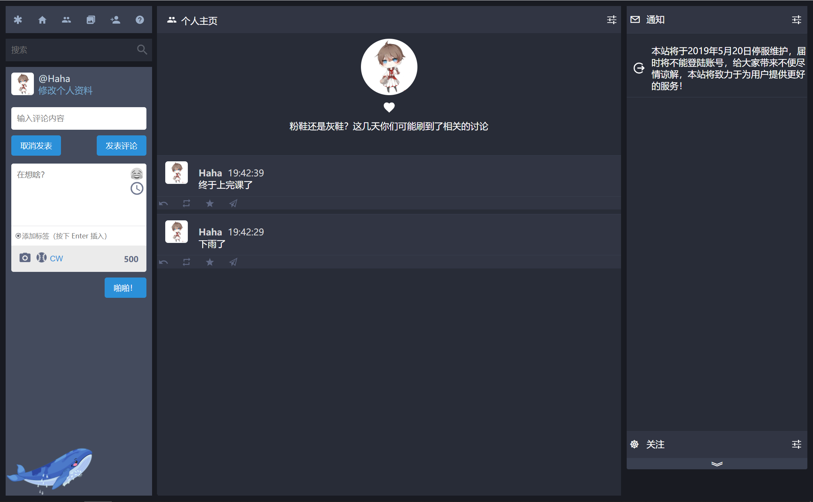
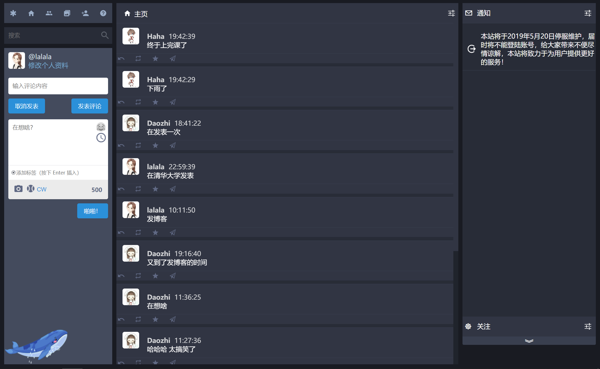

# MicroBlog
这是一个网页版微博平台，已经实现了以下目的：    
- 用户可以正常注册和登录    
- 微博得以按照要求正常发送和显示    
- 用户可以正常评论微博，并查看评论     
- 网页显示正常且美观    

微博作为一种基于用户关系信息分享、传播以及获取的通过关注机制分享简短实时信息的广播式的社交媒体、网络平台，已经成为网络生活的重要部分，本次设计通过使用JAVA语言，综合数据库管理知识、网页开发技术以及服务器连接技术，对微博的基本功能进行实现。
## 一、硬件环境
硬件最小配置:    
- 内存容量：2G     
- CPU：P4 2.8*1    
- 磁盘容量：40G    

## 二、软件环境
### 服务端
- 操作系统：Windows Server 2003以上、Windows 7以上    
- JDK：JDK1.5.0_06版本以上    
- WEB服务器：Tomcat 6.0以上    
- 数据库：MySQL 5.0及以上        

### 客户端：
- 浏览器：IE 7+、Firefox

## 三、数据库文件及Jar包
本项目所用到的Jar包可以在Software文件夹中找到，数据库文件为blog.sql。
## 四、效果展示
主页效果：    

注册界面：    

登录界面：

个人信息维护界面：    

个人主页展示：    

热搜页：

## 五、联系方式
- 邮箱：daozhixs@gmail.com    
- QQ：1725805106